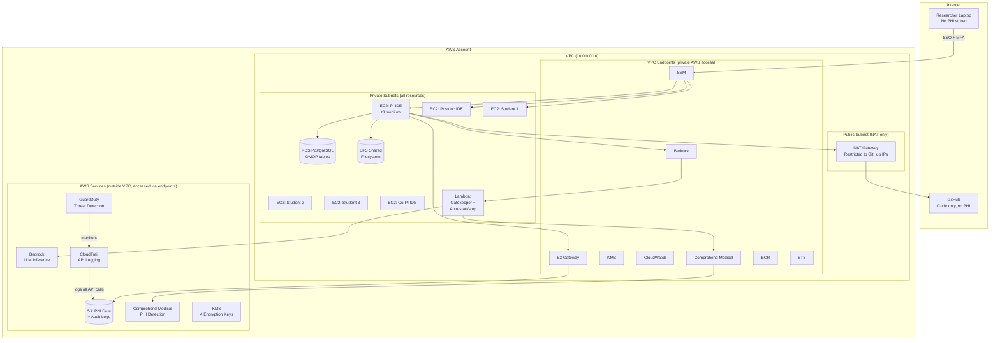
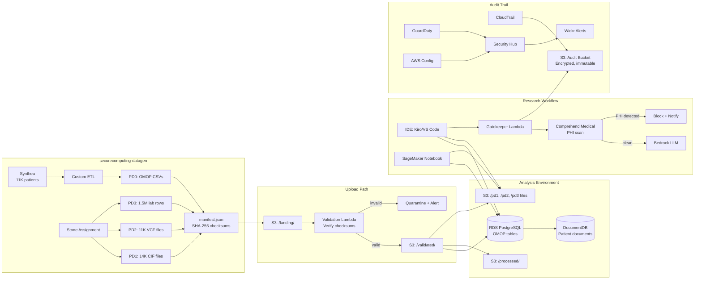
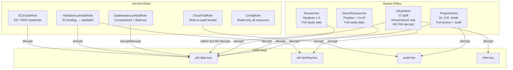
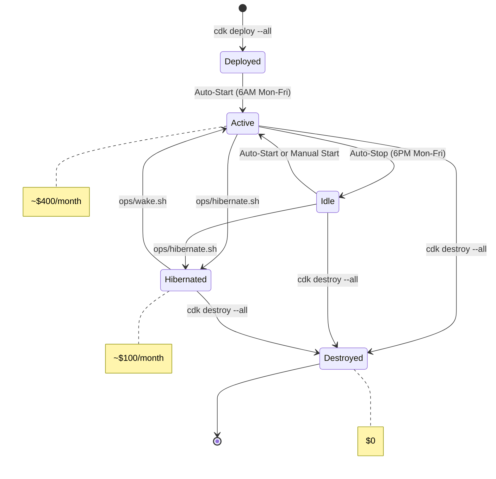

# System Architecture Diagrams

These diagrams render automatically on GitHub. For local rendering, paste into [mermaid.live](https://mermaid.live).

---

## Network Architecture

---

## Data Flow

---

## IAM Role Hierarchy

---

## Lifecycle Modes

