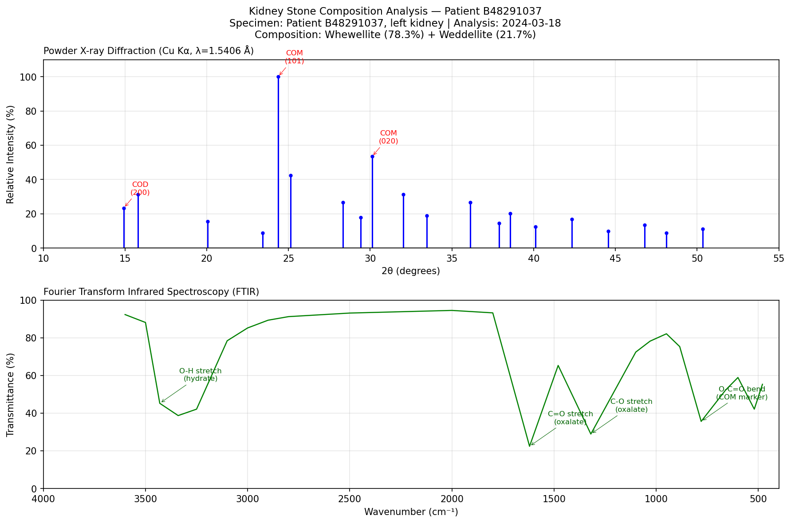

# Synthetic Data Overview

This document describes the synthetic datasets generated for the securecomputing project. All data is entirely fabricated — no real patient information is represented. The data is designed to exercise the full compliance infrastructure (upload path, encryption, access controls, audit logging, gatekeeper) while providing realistic structure for research workflow demonstrations.

> Detailed generation specifications are in `securecomputing-datagen/docs/DATA_DESIGN.md`. This document provides a summary and visual examples.

---

## Dataset Summary

| Dataset | Description | Format | Volume | Link |
|---------|-------------|--------|--------|------|
| **PD0** | Patient EHR (OMOP CDM v5.4) | CSV (relational tables) | 11,272 patients, ~7.3M rows across 8 tables | MRN in PHI_MAPPING |
| **PD1** | Kidney stone composition (PXRD + FTIR) | CIF | 14,638 files (0–3 per patient) | MRN in filename + header |
| **PD2** | Gene sequence data | VCF (Variant Call Format) | 11,272 files (1 per patient) | MRN in filename |
| **PD3** | Lab test results | CSV (tabular, longitudinal) | 1,468,728 rows | MRN column |

All datasets are linked by a common synthetic MRN (format: one uppercase letter + 8 digits, e.g., `B48291037`). Total generated data: ~896 MB across 25,928 files.

---

## PD1: Kidney Stone Composition Analysis

### Clinical Context

Patients with nephrolithiasis (kidney stones) have their stones analyzed via two complementary techniques:
- **Powder X-ray Diffraction (PXRD):** Identifies crystalline mineral phases by their characteristic diffraction angles
- **Fourier Transform Infrared Spectroscopy (FTIR):** Identifies molecular bonds and functional groups by their infrared absorption

Together, these determine stone composition (e.g., 78% calcium oxalate monohydrate + 22% calcium oxalate dihydrate), which directly informs treatment decisions.

### Example Visualization



*Figure: Dual-panel analysis of a synthetic kidney stone specimen (Patient B48291037). Top: Powder XRD pattern showing dominant whewellite (COM) peaks with minor weddellite (COD). Bottom: FTIR spectrum with characteristic oxalate and hydrate absorption bands. Generated by `analysis/notebooks/XRay.ipynb`.*

### Data Format

Each specimen produces a single CIF (Crystallographic Information File) containing:
- Patient MRN and specimen metadata in the header
- PXRD data: 2θ angles and measured intensities
- FTIR data: wavenumber and transmittance values
- Crystal structure parameters for identified mineral phases
- Phase composition percentages

### Common Stone Types Generated

| Mineral | Abbreviation | Frequency | Clinical Significance |
|---------|-------------|-----------|----------------------|
| Whewellite (calcium oxalate monohydrate) | COM | ~70% | Most common; dietary oxalate restriction |
| Weddellite (calcium oxalate dihydrate) | COD | ~10% | Often mixed with COM |
| Uric acid | UA | ~10% | Alkalinize urine; allopurinol |
| Struvite (magnesium ammonium phosphate) | MAP | ~5% | Infection stones; treat underlying UTI |
| Brushite (calcium hydrogen phosphate) | BRU | ~3% | Resistant to lithotripsy |
| Cystine | CYS | ~1% | Genetic disorder; high fluid intake + tiopronin |

---

## PD2: Gene Sequence Data

### Format: VCF (Variant Call Format)

One VCF file per patient containing synthetic genetic variants. VCF is the standard format in clinical genomics for reporting sequence variations relative to a reference genome.

### Details

- 100–500 background variants per patient (benign, genome-wide)
- Stone patients additionally have 1–4 pathogenic variants in stone-associated genes (10 genes: SLC3A1, SLC7A9, CLCN5, CASR, VDR, AGXT, GRHPR, HOGA1, SLC22A12, APRT)
- Variant-to-stone-type correlation is clinically coherent (cystine stones → SLC3A1/SLC7A9; COM stones → AGXT/VDR; uric acid → SLC22A12)
- Structurally valid VCF v4.3 format, GRCh38 reference
- Linked to patient via MRN in filename and header

See `securecomputing-datagen/docs/DATA_DESIGN.md` for full gene list and coherence rules.

---

## PD3: Lab Test Results

### Format: CSV (tabular, longitudinal)

Multiple lab visits per patient (3–12 visits over 2020–2025). Includes standard clinical panels with values correlated with stone type per the clinically coherent design.

### Panels Included

| Panel | Key Tests |
|-------|-----------|
| Basic Metabolic Panel | Glucose, BUN, Creatinine, Sodium, Potassium, Calcium |
| Complete Blood Count | WBC, RBC, Hemoglobin, Hematocrit, Platelets |
| Lipid Panel | Total cholesterol, LDL, HDL, Triglycerides |
| Liver Function | ALT, AST, ALP, Bilirubin, Albumin |
| HbA1c | Hemoglobin A1c (diabetes marker) |
| Stone Panel | Urine calcium, urine oxalate, urine citrate, urine pH, uric acid, urine cystine, phosphorus, PTH |

### Clinically Coherent Design

Lab values are shifted for stone patients to reflect established clinical correlations (e.g., calcium stone patients show elevated urine calcium and low citrate). Non-stone-related tests remain at population-normal values. No novel/unexpected correlations exist in the data.

See `securecomputing-datagen/docs/DATA_DESIGN.md` for full correlation tables.

---

## PD0: Patient EHR (OMOP CDM)

The central dataset: 11,272 synthetic patients in OMOP Common Data Model v5.4 format. Generated via Synthea → custom ETL → OMOP tables, with a PHI extension adding MRNs, and stone-related clinical records enriching the base data.

| OMOP Table | Rows |
|-----------|------|
| person | 11,272 |
| observation_period | 11,272 |
| visit_occurrence | 628,004 |
| condition_occurrence | 399,746 |
| drug_exposure | 498,895 |
| procedure_occurrence | 1,746,871 |
| measurement | 2,983,419 |
| observation | 1,104,789 |

OMOP provides the relational backbone that links all other datasets:
- PD1 links via PROCEDURE_OCCURRENCE (stone analysis ordered) + composition in MEASUREMENT
- PD2 links via patient MRN (genomic variants correlated with stone type)
- PD3 links via MEASUREMENT (lab values also stored in OMOP standard format)

> Full generation pipeline in `securecomputing-datagen/BUILD.md`.

---

## Data Flow

```
securecomputing-datagen (generation)
├── Synthea → ETL → OMOP tables (PD0)
├── CIF generator (PD1 - kidney stones)
├── VCF generator (PD2 - genomics)
├── Lab value generator (PD3)
└── manifest.json (SHA-256 checksums)
         │
         ▼ (upload via standard path)
securecomputing CI (analysis environment)
├── S3 landing zone → validation → S3 validated
├── RDS PostgreSQL (OMOP tables)
├── DocumentDB (per-patient documents)
└── S3 (PD1/PD2/PD3 files, indexed by metadata table)
```

---

*All data in this project is synthetic. It is designed to resemble real clinical data in structure and complexity without representing any actual patients.*
